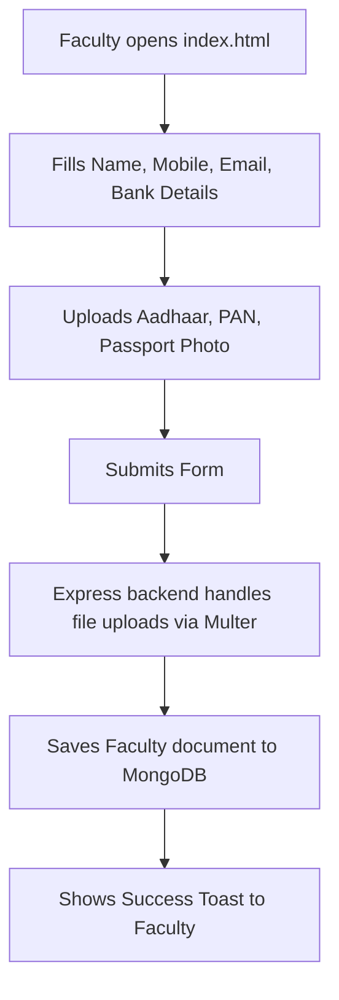
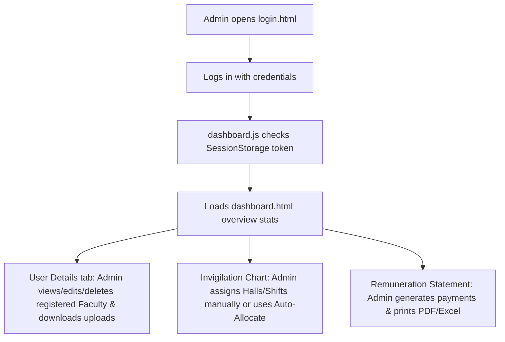

# Faculty Registration & Exam Invigilation Portal

A modern, secure, and responsive full-stack MERN application for managing **Faculty Registrations** and automating **Exam Invigilation allocations & Statements/Invoices**. 

---

## 🌟 System Overview

This application consists of two main portals:
1. **Public Faculty Registration Portal**: A public form where faculty register their profiles, upload mandatory identity documents (Aadhaar, PAN, Passport photo), and bank details for remuneration. No login is required.
2. **Admin Dashboard Portal**: A secured dashboard for administrators to review registered faculty, view/download uploaded documents, allocate invigilation duties, use an **Intelligent Auto-Allocation** algorithm, generate exam remuneration statements, and export reports in Excel or PDF.

---

## 🔄 System Workflows & Flowcharts

### 1. Faculty Registration Flow (Public)


### 2. Admin Portal Flow (Secured)


---

## 📂 Codebase Directory Structure & File Map

```
c:/Faculty_Registration/
├── backend/
│   ├── controllers/
│   │   ├── facultyController.js      # Public registration + Admin User CRUD + Excel export
│   │   ├── invigilationController.js  # Staff Allocation, Intelligent Auto-Allocate, Chart Excel
│   │   └── invoiceController.js      # Statement generation, Save Invoice, Invoice Excel
│   ├── models/
│   │   ├── Faculty.js                # Faculty schema (includes Aadhaar, PAN, Bank Details)
│   │   ├── InvigilationChart.js      # Remuneration-duty assignment schema
│   │   └── Invoice.js                # Remuneration invoicing schema
│   ├── routes/
│   │   ├── facultyRoutes.js          # /api/faculty endpoint routing
│   │   ├── invigilationRoutes.js     # /api/invigilation endpoint routing
│   │   └── invoiceRoutes.js          # /api/invoices endpoint routing
│   ├── uploads/                      # Uploaded Aadhaar/PAN/Photos (Served statically)
│   ├── db.js                         # Mongoose connection logic
│   ├── server.js                     # Server entry, CORS, path config
│   └── .env                          # Backend env variables (PORT, MONGO_URI)
│
└── frontend/
    ├── index.html                    # Public Faculty Registration Page
    ├── script.js                     # Public Registration JS + validations
    ├── style.css                     # Public Registration styles (Dark theme by default)
    ├── login.html                    # Admin login page
    ├── dashboard.html                # Redesigned Admin Dashboard (Purple theme SPA)
    └── dashboard.js                  # Secured Dashboard SPA logic, PDF, smart URL config
```

---

## 🔌 API Reference Table

| Path | Method | Description | Access |
|---|---|---|---|
| `/api/faculty` | `POST` | Registers new faculty member (includes file upload) | **Public** |
| `/api/faculty` | `GET` | Gets all faculty profiles (supports `?search=`) | **Admin** |
| `/api/faculty/stats` | `GET` | Aggregated metrics & role counts for dashboard stats | **Admin** |
| `/api/faculty/all` | `GET` | Raw list of active faculties for dropdown lists | **Admin** |
| `/api/faculty/download/excel` | `GET` | Downloads full registration database as styled Excel | **Admin** |
| `/api/faculty/:id` | `GET` | Fetches details of a single faculty profile | **Admin** |
| `/api/faculty/:id` | `PUT` | Updates faculty data (manages Status/Availability) | **Admin** |
| `/api/faculty/:id` | `DELETE` | Removes a faculty record | **Admin** |
| `/api/invigilation` | `GET` | Gets list of saved invigilation charts | **Admin** |
| `/api/invigilation` | `POST` | Saves an exam invigilation allocation chart | **Admin** |
| `/api/invigilation/staff` | `GET` | Gets active faculty ready for allocation dropdowns | **Admin** |
| `/api/invigilation/auto-allocate` | `POST` | Run auto-allocate duty algorithm based on experience | **Admin** |
| `/api/invigilation/:id/excel` | `GET` | Downloads invigilation duty sheet as Excel | **Admin** |
| `/api/invoices` | `GET` | Gets saved remuneration statements | **Admin** |
| `/api/invoices` | `POST` | Saves a remuneration statement | **Admin** |
| `/api/invoices/generate` | `GET` | Auto-calculates statement for given exam date | **Admin** |
| `/api/invoices/:id/excel` | `GET` | Remuneration bank transfer file as Excel sheet | **Admin** |

---

## ⚙️ Local Development Setup

### Prerequisites
- Node.js (v16+) installed.
- MongoDB running locally (or MongoDB Atlas connection string).

### Step 1: Configure Environment
Create `backend/.env`:
```env
PORT=8000
MONGO_URI=mongodb://127.0.0.1:27017/faculty_db
```

### Step 2: Start Backend
```bash
cd backend
npm install
node server.js
# Expected: "Server running on port 8000" & "MongoDB Connected"
```

### Step 3: Run Frontend
Launch `frontend/index.html` or `frontend/login.html` using a local server (like VS Code **Live Server** on port 5500).
- **Environment Auto-Detection:** `dashboard.js` automatically detects if it's running locally (using `http://localhost:8000`) or in production, so you never have to manually edit API links!

---

## 🚀 Deployed Server Configuration (Render & Netlify)

1. **Backend Deployment (Render):**
   - Connect your Git repo to Render.
   - Set Build Command: `npm install`
   - Set Start Command: `node server.js`
   - Configure environment variables `MONGO_URI` (pointing to your Atlas DB).
2. **Frontend Deployment (Netlify/GitHub Pages):**
   - Upload the contents of the `frontend` folder.
   - Set CORS settings in backend `server.js` if deploying frontend to a different domain.

---

## 🔒 Security & Performance Features

- **Document Secure Storage:** Faculty documents (Aadhaar/PAN) are renamed using unique suffixes and saved directly in `/uploads` directory, which can be viewed only by authorized admins through the View modal.
- **Client-Side Remuneration Statement Generator:** remits PDF using **jsPDF** directly in the browser to reduce load on the backend server.
- **Conflict Prevention:** Real-time checking during duty allocation. If a faculty member is assigned to two different halls in the same shift on the same day, a warning badge is highlighted instantly.
